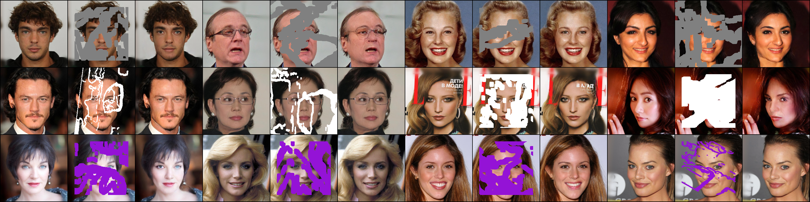

# PartialConv-Inpainting-pytorch

> Liu, Guilin, Fitsum A. Reda, Kevin J. Shih, Ting-Chun Wang, Andrew Tao, and Bryan Catanzaro. "Image inpainting for irregular holes using partial convolutions." In *Proceedings of the European conference on computer vision (ECCV)*, pp. 85-100. 2018.

Unofficial implementation of Partial Convolution.

<br/>


## Installation

Clone this repo:

```shell
git clone https://github.com/xyfJASON/PartialConv-Inpainting-pytorch.git
cd Context-Encoder-pytorch
```

Create and activate a conda environment:

```shell
conda create -n partialconv python=3.9
conda activate partialconv
```

Install dependencies:

```shell
pip install -r requirements.txt
```

The code will use pretrained VGG16, which can be downloaded by:

```shell
 wget https://download.pytorch.org/models/vgg16-397923af.pth -o ~/.cache/torch/hub/checkpoints/vgg16-397923af.pth
```

<br/>


## Notes on masks

Please refer to [doc](./docs/notes-on-masks.md).

<br/>


## Training

```shell
accelerate-launch train.py [--finetune] [-c CONFIG] [-e EXP_DIR] [--xxx.yyy zzz ...]
```

- This repo uses the [🤗 Accelerate](https://huggingface.co/docs/accelerate/index) library for multi-GPUs/fp16 supports. Please read the [documentation](https://huggingface.co/docs/accelerate/basic_tutorials/launch#using-accelerate-launch) on how to launch the scripts on different platforms.

- Results (logs, checkpoints, tensorboard, etc.) of each run will be saved to `EXP_DIR`. If `EXP_DIR` is not specified, they will be saved to `runs/exp-{current time}/`.

- To modify some configuration items without creating a new configuration file, you can pass `--key value` pairs to the script.

For example, to train the model on CelebA-HQ (256x256) using mask images from a specified directory:

```shell
# training
python train.py -c ./configs/celebahq-256-maskdir.yaml
# fine-tuning
python train.py --finetune -c ./configs/celebahq-256-maskdir-finetune.yaml --train.pretrained ./runs/exp-xxx/ckpt/step199999/model.pt
```

<br/>


## Evaluation

To evaluate L1 Error, PSNR and SSIM:

```shell
accelerate-launch evaluate.py -c CONFIG \
                              --model_path MODEL_PATH \
                              [--n_eval N_EVAL] \
                              [--micro_batch MICRO_BATCH]
```

- This repo uses the [🤗 Accelerate](https://huggingface.co/docs/accelerate/index) library for multi-GPUs/fp16 supports. Please read the [documentation](https://huggingface.co/docs/accelerate/basic_tutorials/launch#using-accelerate-launch) on how to launch the scripts on different platforms.
- You can adjust the batch size on each device by `--micro_batch MICRO_BATCH`.
- All of the metrics are evaluated on the **composited output**, i.e., pixels outside the masked area are replaced by the ground-truth.

To calculate Inception Score, please sample images following the next section with argument `--for_evaluation`, and then use tools like [torch-fidelity](https://github.com/toshas/torch-fidelity).

<br/>


## Sampling

```shell
accelerate-launch sample.py -c CONFIG \
                            --model_path MODEL_PATH \
                            --n_samples N_SAMPLES \
                            --save_dir SAVE_DIR \
                            [--micro_batch MICRO_BATCH] \
                            [--for_evaluation]
```

- This repo uses the [🤗 Accelerate](https://huggingface.co/docs/accelerate/index) library for multi-GPUs/fp16 supports. Please read the [documentation](https://huggingface.co/docs/accelerate/basic_tutorials/launch#using-accelerate-launch) on how to launch the scripts on different platforms.
- You can adjust the batch size on each device by `--micro_batch MICRO_BATCH`. The sampling speed depends on your system and larger batch size doesn't necessarily result in faster sampling.

<br/>


## Results


### CelebA-HQ (256x256)

**Quantitative results**:

Evaluated on CelebA-HQ test set (2824 images).

<table align="center">
  <tr>
    <th align="center">Mask type and ratio</th>
    <th align="center">L1</th>
    <th align="center">PSNR</th>
    <th align="center">SSIM</th>
    <th align="center">IScore</th>
  </tr>
  <tr>
    <td align="center">irregular (0.01, 0.1]</td>
    <td align="center">0.0019</td>
    <td align="center">39.2560</td>
    <td align="center">0.9840</td>
    <td align="center">3.6035 ± 0.0927</td>
  </tr>
  <tr>
    <td align="center">irregular (0.1, 0.2]</td>
    <td align="center">0.0055</td>
    <td align="center">33.0008</td>
    <td align="center">0.9558</td>
    <td align="center">3.5556 ± 0.1290</td>
  </tr>
  <tr>
    <td align="center">irregular (0.2, 0.3]</td>
    <td align="center">0.0105</td>
    <td align="center">29.5313</td>
    <td align="center">0.9184</td>
    <td align="center">3.4656 ± 0.1437</td>
  </tr>
  <tr>
    <td align="center">irregular (0.3, 0.4]</td>
    <td align="center">0.0165</td>
    <td align="center">26.9910</td>
    <td align="center">0.8774</td>
    <td align="center">3.3983 ± 0.1238</td>
  </tr>
  <tr>
    <td align="center">irregular (0.4, 0.5]</td>
    <td align="center">0.0234</td>
    <td align="center">25.0421</td>
    <td align="center">0.8335</td>
    <td align="center">3.2684 ± 0.0665</td>
  </tr>
  <tr>
    <td align="center">irregular (0.5, 0.6]</td>
    <td align="center">0.0419</td>
    <td align="center">21.5027</td>
    <td align="center">0.7514</td>
    <td align="center">3.0239 ± 0.1464</td>
  </tr>
</table>


**Visualization**:

<p align="center">
  
</p>

The content in the masked area doesn't affect the output, which verifies the effectiveness of partial convolution.
