# Notes on Masks


## Overview

The code supports various types of masks:

 - `dir`: masks are stored in a directory as binary (or gray-level) images.
 - `center`: a rectangular mask at the center of the image.
 - `rect`: rectangular masks of random sizes at random positions.
 - `brush`: random brushstroke-like masks at random positions.
 - `half`: mask half of the image.
 - `every-second-line`: mask every second line of the image.
 - `sr2x`: mask every second row and every second column of the image.

If multiple types of masks are set, they will overlap with each other, which is helpful if you want both rectangles and brush strokes in a mask.

The core code is `MaskGenerator` class in [`utils/mask.py`](../utils/mask.py):

```python
class MaskGenerator:
    def __init__(
            self,
            mask_type: Union[str, List[str]] = 'center',
            dir_path: str = None,                                       # dir
            dir_invert_color: bool = False,                             # dir
            center_length_ratio: Tuple[float, float] = (0.25, 0.25),    # center
            rect_num: Tuple[int, int] = (1, 4),                         # rect
            rect_length_ratio: Tuple[float, float] = (0.2, 0.8),        # rect
            brush_num: Tuple[int, int] = (1, 9),                        # brush
            brush_n_vertex: Tuple[int, int] = (4, 18),                  # brush
            brush_mean_angle: float = 2 * math.pi / 5,                  # brush
            brush_angle_range: float = 2 * math.pi / 15,                # brush
            brush_width_ratio: Tuple[float, float] = (0.02, 0.1),       # brush
            is_train: bool = False,
    ):
        ...
```

which is further wrapped in `DatasetWithMask` class for ease of loading.


## Rectangles

Some examples with the following settings:

````python
rect_num = (1, 4)
rect_length_ratio = (0.2, 0.8)
````

<p align="center">
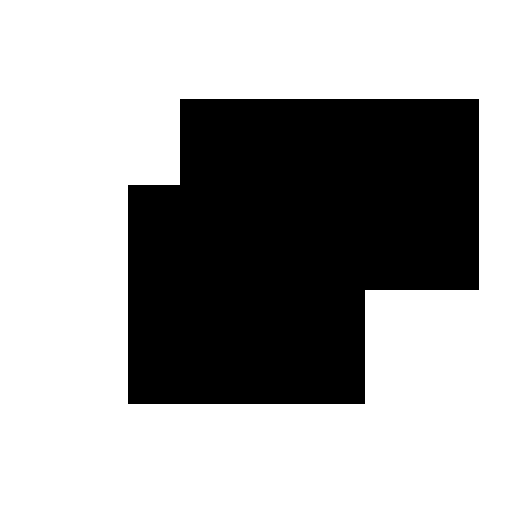 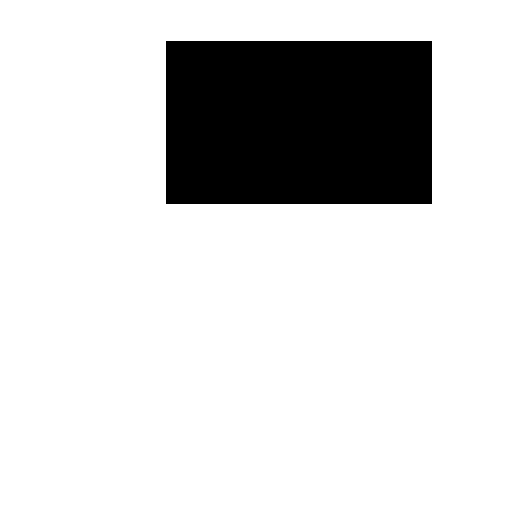 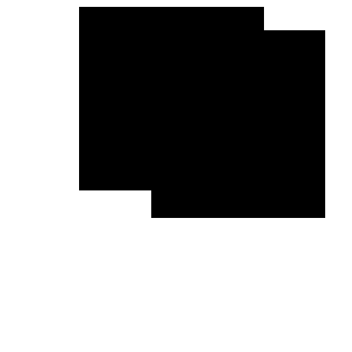  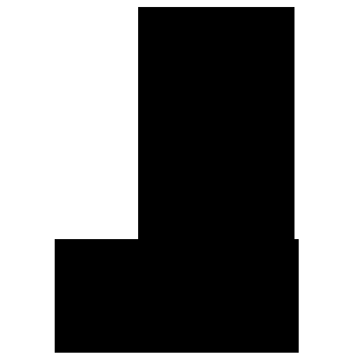
</p>
Statistics over 36,500 masks:

<p align="center">
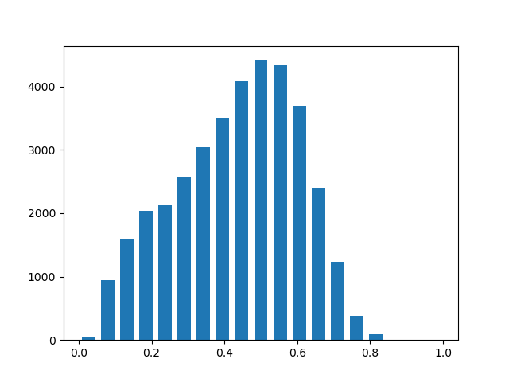
</p>


## Brushes

Some examples with the following settings:

```python
brush_num = (1, 9)
brush_n_vertex = (4, 18)
brush_mean_angle = 2 * math.pi / 5
brush_angle_range = 2 * math.pi / 15
brush_width_raio = (0.02, 0.1)
```

<p align="center">
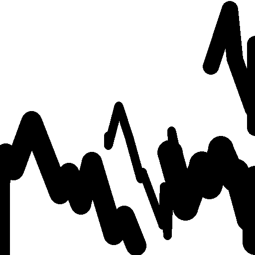 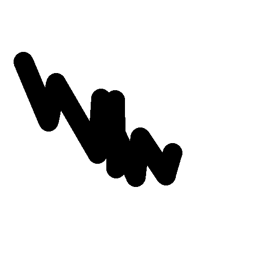  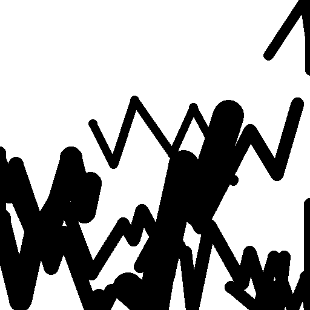 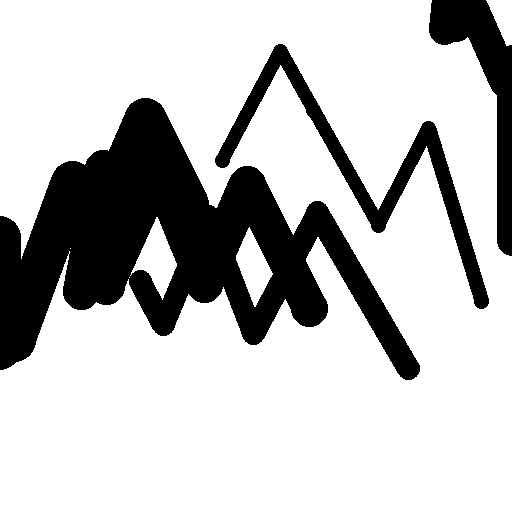
</p>
Statistics over 36,500 masks:

<p align="center">

</p>


## Mask Images

The mask images should be gray-level or binary.


### NVIDIA Irregular Mask Dataset

It is recommended to use irregular masks published by NVIDIA in paper [Image Inpainting for Irregular Holes Using Partial Convolutions](https://arxiv.org/abs/1804.07723), which can be downloaded from https://nv-adlr.github.io/publication/partialconv-inpainting.

The dataset contains 55,116 "disocclusion masks" and 12,000 pre-processed "irregular masks". NVIDIA research says that they use the former to train the model, applying random dilation, rotation, etc. to augment the masks, and use the latter for testing. However, I found that the augmentation process consumes much time during training, so I use the data in a way similar to [EdgeConnect](https://arxiv.org/abs/1901.00212), which can be found at https://github.com/knazeri/edge-connect/issues/28#issuecomment-456440064.

In practice, after downloading the dataset, please run [`_make_irregular_dataset.py`](./_make_irregular_dataset.py). Two directories `train` and `test` will be created and mask images will be stored in them grouped by their area ratios.

Some examples:

<p align="center">
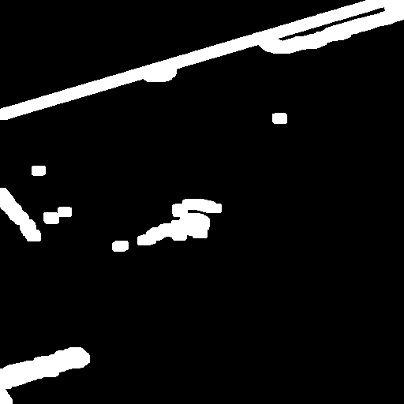 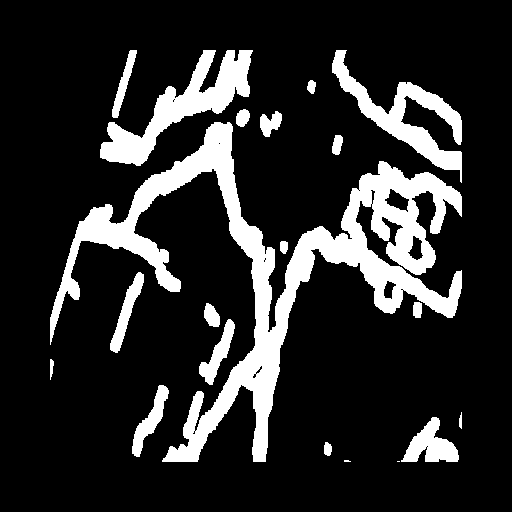 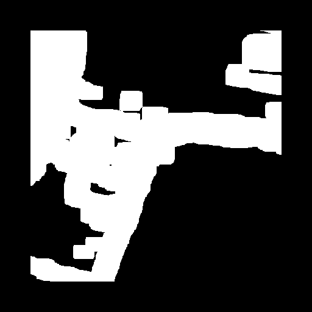 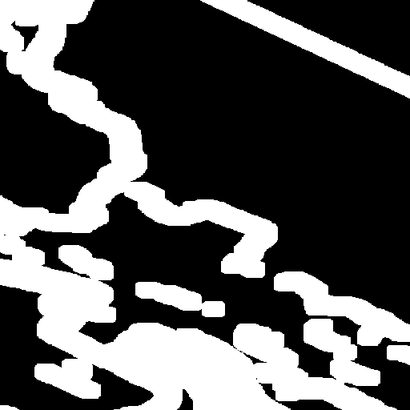 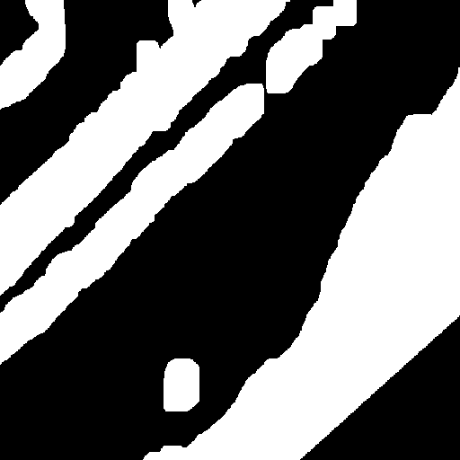
</p>
